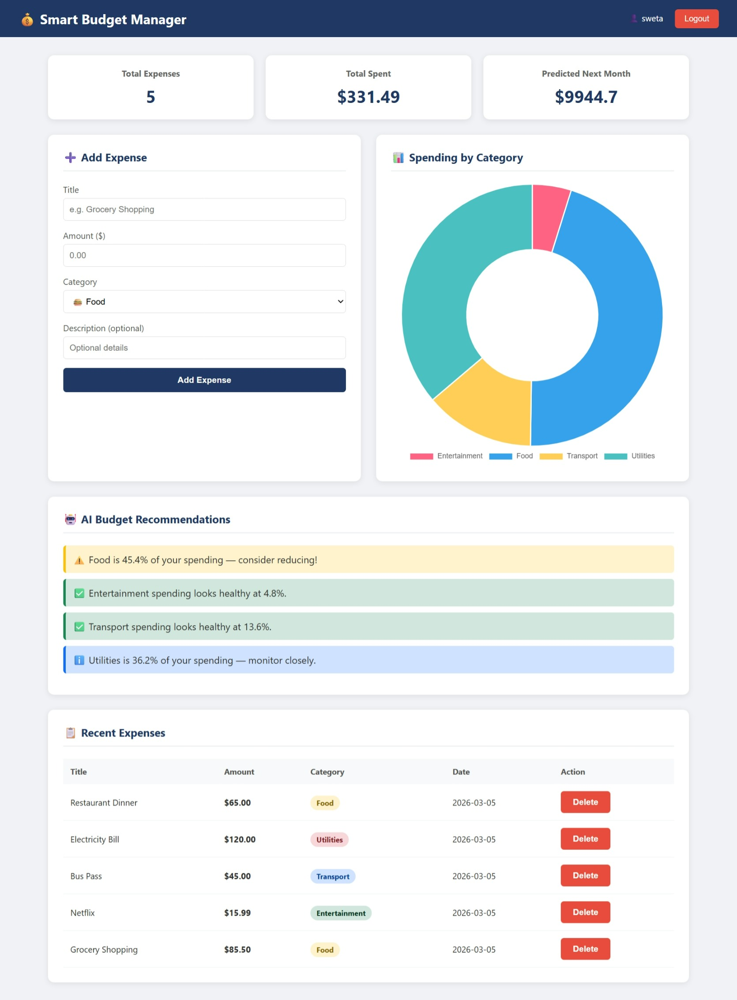
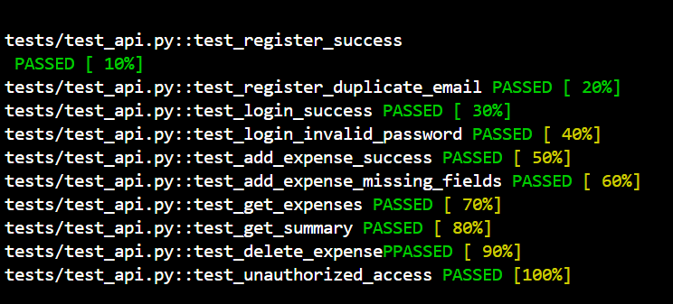
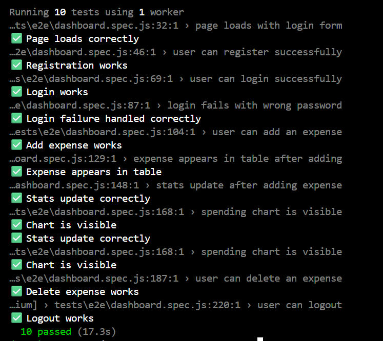
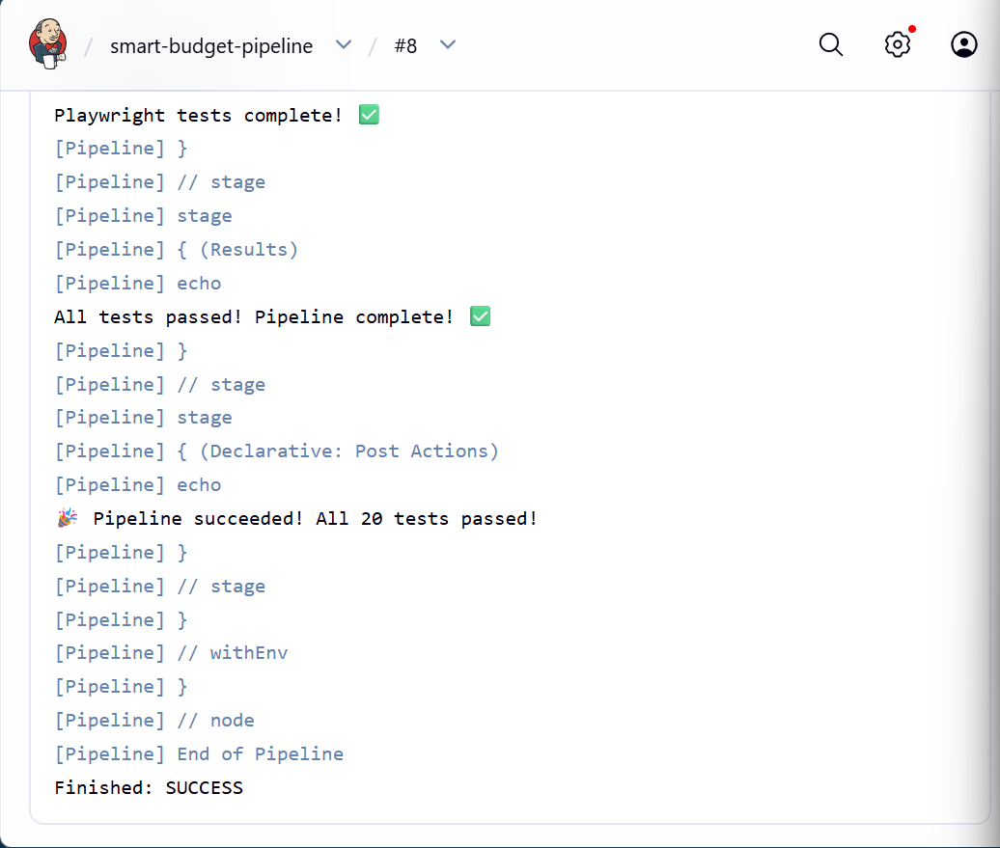
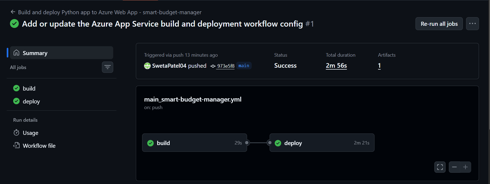

# 💰 Smart Budget Manager

A full-stack AI-powered budget tracking application built with Python/Flask, 
Machine Learning predictions, automated testing, and complete CI/CD pipeline.

## 🌐 Deployment
Successfully deployed to Microsoft Azure Web Apps using GitHub Actions CI/CD pipeline.
---

## 📸 Screenshots

### 🏠 Dashboard


### ✅ pytest Results


### 🎭 Playwright Results  


### 🔧 Jenkins Pipeline


### ☁️ Azure Deployment


---

## 🛠️ Tech Stack

| Category | Technologies |
|----------|-------------|
| **Backend** | Python, Flask, Flask-SQLAlchemy, Flask-JWT-Extended |
| **Database** | SQLite |
| **AI/ML** | scikit-learn, Linear Regression, pandas, numpy |
| **Frontend** | HTML5, CSS3, JavaScript, Chart.js |
| **Testing** | pytest (10 tests), Playwright E2E (10 tests) |
| **CI/CD** | Jenkins, Docker, GitHub Actions |
| **Cloud** | Microsoft Azure Web Apps |
| **Security** | JWT Authentication, Flask-Bcrypt, OWASP Input Validation |
| **Project Mgmt** | Jira (Agile/Scrum) |

---

## ✨ Features

- ✅ JWT Authentication — Register & Login securely
- ✅ Expense CRUD — Add, view, update, delete expenses
- ✅ Category Tracking — Food, Transport, Entertainment, Utilities
- ✅ ML Predictions — Linear Regression predicts next month spending
- ✅ AI Recommendations — Smart budget advice based on spending patterns
- ✅ Interactive Charts — Doughnut chart by category (Chart.js)
- ✅ Real-time Stats — Total expenses, total spent, predicted next month
- ✅ Automated Tests — 20 tests at 100% pass rate
- ✅ CI/CD Pipeline — Auto-deploy on every GitHub push

---

## 🏗️ Project Structure
```
smart-budget-manager/
├── app/
│   ├── __init__.py          # App factory, extensions
│   ├── routes/
│   │   ├── auth.py          # Register, Login endpoints
│   │   └── expenses.py      # CRUD + ML predictions
│   ├── models/
│   │   ├── user.py          # User model with bcrypt
│   │   └── expense.py       # Expense model
│   └── ml/
│       └── predictor.py     # Linear Regression model
├── tests/
│   ├── conftest.py          # pytest fixtures
│   ├── test_api.py          # 10 pytest unit tests
│   └── e2e/
│       └── dashboard.spec.js # 10 Playwright E2E tests
├── templates/
│   └── base.html            # Full dashboard UI
├── Jenkinsfile              # CI/CD pipeline
├── Dockerfile               # Container config
├── requirements.txt         # Python dependencies
└── run.py                   # App entry point
```

---

## 🚀 How to Run Locally
```bash
# Clone repository
git clone https://github.com/SwetaPatel04/smart-budget-manager.git
cd smart-budget-manager

# Create virtual environment
python -m venv venv
venv\Scripts\activate  # Windows

# Install dependencies
pip install -r requirements.txt

# Run app
python run.py

# Visit
http://127.0.0.1:5000
```

---

## 🧪 How to Run Tests
```bash
# Run pytest (10 unit tests)
pytest tests/test_api.py -v

# Run Playwright E2E tests (10 tests)
npx playwright test --project=chromium
```

---

## 🤖 ML Model

| Detail | Value |
|--------|-------|
| **Algorithm** | Linear Regression (scikit-learn) |
| **Input** | Historical expense data |
| **Output** | Predicted next month spending |
| **Features** | Category insights, % breakdowns, recommendations |

---

## 🔧 CI/CD Pipeline
```
Push to GitHub
      ↓
Jenkins detects push
      ↓
Install Python dependencies
      ↓
Run pytest (10 tests) ✅
      ↓
Install Playwright
      ↓
Start Flask app
      ↓
Run Playwright E2E (10 tests) ✅
      ↓
GitHub Actions deploys to Azure ✅
      ↓
Live app updated! 🎉
```

---

## 📋 Jira Project Management

| Sprint | Stories | Status |
|--------|---------|--------|
| Sprint 1 | SBM-1: Auth, SBM-2: Expenses API | ✅ Done |
| Sprint 2 | SBM-3: ML, SBM-4: Dashboard, SBM-5: Tests | ✅ Done |
| Sprint 3 | SBM-6: Jenkins, SBM-7: Azure | ✅ Done |

---

## 📊 Test Results

| Test Suite | Tests | Pass Rate |
|------------|-------|-----------|
| pytest unit tests | 10/10 | 100% ✅ |
| Playwright E2E tests | 10/10 | 100% ✅ |
| Manual tests | 8/8 | 100% ✅ |
| **Total** | **28/28** | **100%** ✅ |

---

## 🔒 Security

- JWT tokens with 24hr expiry
- Bcrypt password hashing
- OWASP A03 input validation on all endpoints
- SQL injection prevention via SQLAlchemy ORM
- Unauthorized access returns 401

---

## 👩‍💻 Author

**Sweta Patel**  
MCS Graduate | Python Developer | DevOps Engineer  
[LinkedIn](https://linkedin.com/in/sweta-patel) | 
[GitHub](https://github.com/SwetaPatel04)
